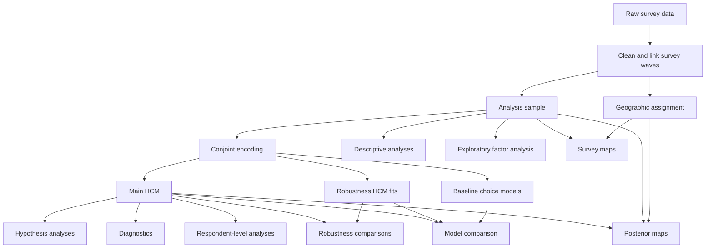

# Natural Hazard Solidarity

Reproducible Snakemake workflow for the two-wave natural-hazard solidarity survey and conjoint experiment.

The workflow covers:

- survey preprocessing and sample construction
- conjoint encoding
- Bayesian model estimation
- hypothesis analyses
- descriptive and respondent-level figures
- exploratory factor analysis for the latent constructs
- robustness analyses
- geographic analyses and maps for the simulated data and survey data
- model diagnostics and comparison

## Quick start

### Requirements

The workflow is currently designed for a system that requires:

1. [Git](https://git-scm.com/)
2. [Miniforge](https://conda-forge.org/miniforge/)
3. [MSYS2](https://www.msys2.org/) with the [UCRT64 GCC compiler](https://www.mingw-w64.org/getting-started/msys2/).The compiler is used by PyTensor/PyMC to compile numerical model operations and substantially improve sampling performance.

The Python environment and all Python/R-independent workflow dependencies are defined in the ```environment.yaml``` file.

When the above 3 requirements are fullfilled you can clone the repository and create the python environment used for the project.

### 1. Clone the repository

Open a terminal and clone the repository:

```cmd
git clone <repository-url>
cd natural_hazard_solidarity
```

### 2. Create the Conda environment

Create the project environment from `environment.yaml`:

```cmd
conda env create -f environment.yaml
```

The default environment name is:

```text
natural-hazard-solidarity
```

You can verify that the environment was created with:

```cmd
conda env list
```

### 3. Configure local settings

Machine-specific settings are stored separately from the repository.

Copy:

```text
local_settings.example.bat
```

to:

```text
local_settings.bat
```

Then open `local_settings.bat` and adjust the paths if necessary. A typical configuration is:

```bat
@echo off

set "PROJECT_ENV=natural-hazard-solidarity"
set "SNAKEMAKE_CORES=4"

set "MSYS2_UCRT64=C:\msys64\ucrt64"
set "PYTENSOR_CXX=C:/msys64/ucrt64/bin/g++.exe"
```

`local_settings.bat` is intentionally excluded from Git because it contains machine-specific paths.

### 4. Add the required input data

The raw survey and geographic input data are not distributed with this repository.

Place the required files in:

```text
resources/
```

The expected structure is approximately:

```text
resources/
├── Survey_Adaptation Natural Hazards_First Wave_raw data.csv
├── Survey_Adaptation Natural Hazards_Second Wave_raw data.csv
├── id_list.csv
├── swissBOUNDARIES3D_1_5_LV95_LN02.gpkg
└── AMTOVZ_CSV_WGS84.csv
```

For a complete description of the required input files, their purpose, and their source, see:

```text
docs/data.md
```

### 5. Test the installation

Before running the full workflow, perform a Snakemake dry run. This checks whether Snakemake can construct the workflow DAG without executing any jobs.

```cmd
run_workflow.bat -n
```

### 6. Run the complete workflow

To actually execute the complete default workflow run:

```cmd
run_workflow.bat
```

Snakemake automatically determines which files are missing or outdated and runs only the required steps. Already up-to-date outputs are not recomputed.


## Running individual workflow components

Individual parts of the workflow can also be run separately:

```cmd
run_workflow.bat conjoint_data
run_workflow.bat main_model
run_workflow.bat hypotheses
run_workflow.bat requested_plots
run_workflow.bat diagnostics
run_workflow.bat maps
run_workflow.bat robustness_plots
run_workflow.bat model_comparison
```

Generated files are written to:

```text
results/
```

## Workflow overview

The main analysis flow is approximately:



Snakemake tracks these dependencies automatically. If an upstream input
or source file changes, affected downstream outputs are regenerated.


## Configuration

Scientific and workflow settings are defined in:

```text
config/config.yaml
```

This file contains project-level settings that should be reproducible across machines.

Machine-specific settings instead belong in:

```text
local_settings.bat
```

Examples include:

- Conda environment name
- number of Snakemake cores
- local MSYS2 path
- local C++ compiler path

Don't place machine-specific paths in `config/config.yaml`.


## Output structure

Generated files are written below:

```text
results/
```

The main structure is approximately:

```text
results/
├── data/
├── figures/
│   ├── hypotheses/
│   ├── maps/
│   └── robustness/
├── models/
└── tables/
    ├── audit/
    ├── diagnostics/
    ├── hypotheses/
    ├── maps/
    ├── robustness/
    └── comparisons/
```

The `results/` directory is generated by the workflow and is not intended to contain manually edited source data.


## Re-running the workflow

Snakemake only executes jobs whose outputs are:

- missing
- older than relevant input files
- affected by changed dependencies

For example, if:

```text
results/figures/hypotheses/H1-pre-post-shift.png
```

is deleted, running:

```cmd
run_workflow.bat
```

will regenerate the missing figure without unnecessarily rerunning unrelated analyses.

A dry run can be used to inspect what Snakemake intends to execute:

```cmd
run_workflow.bat -n
```


## Repository structure

The most important directories are listed below.
The workflow separates files into a structure that is intended to make the complete analysis traceable and reproducible from the original input data to the final figures and tables.

- `src/`: Contains the reusable Python implementation of the scientific analyses.

- `workflow/`: Contains the Snakemake workflow, rules, and workflow scripts.

- `config/`: Contains reproducible project configuration.

- `resources/`: Contains external/raw input files that are not generated by the workflow.

- `results/`: Contains generated datasets, fitted models, tables, and figures.

- `docs/`:Contains more detailed project documentation, specifically:
  - [`docs/workflow.md`](docs/workflow.md): Workflow targets, analysis functionality, and generated outputs.
  - [`docs/data.md`](docs/data.md): Required input files, data sources, and expected resource structure.
  - [`docs/architecture.md`](docs/architecture.md): Code organization and guidance on where new functionality should be implemented.

## Recommended workflow for development

When modifying the analysis code:

1. Make the code change.
2. Inspect the planned Snakemake execution:

```cmd
run_workflow.bat -n
```

3. Run the relevant target, for example:

```cmd
run_workflow.bat hypotheses
```

6. Before committing larger changes, verify the complete workflow:

```cmd
run_workflow.bat -n
```


