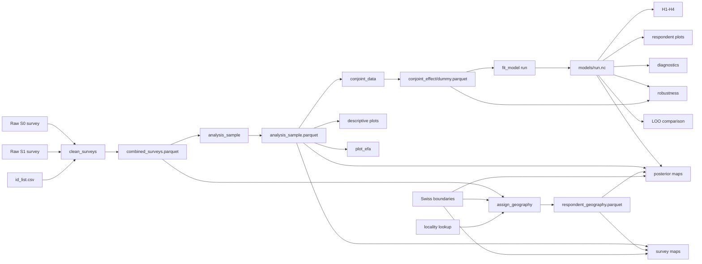

# Natural Hazard Solidarity

Reproducible Snakemake workflow for the two-wave natural-hazard solidarity survey and conjoint experiment. The repository replaces the original notebook-based analysis with a configuration-driven pipeline for data cleaning, sample construction, conjoint encoding, Bayesian model fitting, posterior analyses, robustness checks, descriptive figures, EFA, respondent-level figures, and cantonal maps.

The workflow is designed so that scientific logic lives in `src/natural_hazard_solidarity/`, workflow orchestration lives in `workflow/`, and machine-specific paths/settings remain local.


## Setup

1. Install Miniforge.
2. Create/activate a Snakemake controller environment.
3. Install MSYS2 UCRT64 and verify `C:\msys64\ucrt64\bin\g++.exe`.
4. Copy `local_settings.example.bat` to `local_settings.bat` and adapt machine-specific paths.
5. Place the local input files under `resources/`.

The complete analysis uses a single Conda environment defined in
`environment.yaml`. It contains Snakemake, PyMC, the EFA dependencies,
geospatial libraries, plotting packages, and the test dependencies.

### 1. Install Conda

Install [Miniforge](https://github.com/conda-forge/miniforge) if Conda is not
already available.

On Windows, PyTensor additionally requires the MSYS2/UCRT64 compiler used by
this project. The local compiler configuration is handled separately from the
Conda environment.

### 2. Create the project environment
In the Miniforge prompt, clone the repository:

```cmd
git clone <repository-url>
cd natural_hazard_solidarity

Create the project environment:

```cmd
conda env create -f environment.yaml


## 2. Workflow DAG



For a rule-level DAG generated by Snakemake itself, use Graphviz if installed:

```cmd
run_workflow.bat --dag > workflow_dag.dot
dot -Tpng workflow_dag.dot -o workflow_dag.png
```

## Local input resources

The raw survey and geographic data are not distributed with this repository.
Place the required files under `resources/`.

Required survey files:

- `resources/Survey_Adaptation Natural Hazards_First Wave_raw data.csv`
- `resources/Survey_Adaptation Natural Hazards_Second Wave_raw data.csv`
- `resources/id_list.csv`

Required geographic resources:

- `resources/swissBOUNDARIES3D_1_5_LV95_LN02.gpkg`
- `resources/AMTOVZ_CSV_WGS84.csv`
data_version_note: "swissBOUNDARIES3D 2025; AMTOVZ downloaded 2026-09-xx"

Before handing the repository to another user, record the exact source, edition/date and acquisition location of the two geographic files and the version of the raw survey exports. The workflow stores SHA-256 hashes for the raw survey files and the encoded conjoint parquet in its generated audit/model metadata.


## 5. Running the workflow

Run commands from the repository root.

```cmd
run_workflow.bat -n
```

performs a dry-run of the default target.

```cmd
run_workflow.bat
```

runs the default `all` target: preprocessing, configured default model(s), pre/post distributions, and H1-H4.

Useful public targets:

| Target | Purpose |
|---|---|
| `preprocess` | build the configured conjoint parquet |
| `main_model` | fit `results/models/main.nc` |
| `hypotheses` | produce H1-H4 figures and tables |
| `diagnostic_plots` | produce posterior trace/density diagnostic |
| `requested_plots` | produce descriptive/EFA/respondent/diagnostic thesis figures |
| `robustness_plots` | fit missing robustness models and create robustness figures |
| `model_comparison` | create configured LOO comparison tables |
| `maps` | create configured survey and posterior maps |
| `check` | run the test suite and write `results/validation/tests.txt` |

Examples:

```cmd
run_workflow.bat hypotheses
run_workflow.bat requested_plots
run_workflow.bat robustness_plots
run_workflow.bat maps -n
run_workflow.bat check
```

Any concrete output file can also be requested directly, e.g.:

```cmd
run_workflow.bat results/figures/hypotheses/H4-vulnerability-heatmap.png
```

Snakemake will execute only the missing/outdated upstream dependencies required for that file.

## 6. Configuration

`config/config.yaml` is the main user-facing control surface. It contains choices that may legitimately vary without editing Python code.

### `project`

Defines the output root. Generated files are written below `results/` by default.

### `data` and `preprocessing`

Defines raw survey paths, respondent linking keys, quality filters, duration filters, within-wave and cross-wave imputation, and the acceptance-consistency rule.

Important preserved legacy behavior:

- imputation is item-wise and draw-independent preprocessing, not model-based imputation;
- natural-hazard vulnerability and financial vulnerability are first filled within wave and then item-wise across waves;
- psychological-distance items are filled within S1;
- `all_acceptance_consistent` preserves the legacy definition configured through `max_inconsistent_tasks`.

### `conjoint`

Defines the choice attributes, levels, baselines and encoding.

`coding` must be either:

```yaml
coding: effect
```

or:

```yaml
coding: dummy
```

One complete workflow run should use one coding consistently from conjoint encoding through model fitting and plotting. Posterior utilities are reconstructed centrally in `posterior.py`: dummy-coded baselines are zero; effect-coded baselines are reconstructed as the negative sum of the non-baseline coefficients. Fitted NetCDF files store the coding in their metadata and plots check that it matches the active config.

### `constructs`

Defines the observed items used for latent natural-hazard vulnerability, psychological distance and financial vulnerability in the HCM.

### `samples`

Defines reusable model samples. Filters act on the encoded conjoint table. `exclude_tasks` removes whole choice tasks matching all configured conditions.

### `sampling`

Controls PyMC draws, tuning, chains, target acceptance and random seed. The launcher may provide fewer total Snakemake cores than `sampling.cores`; Snakemake scales the rule threads accordingly.

### `models`

Defines named model runs. The default family is the main HCM; `simple` and `mixed_logit` are baseline choice models used for comparison.

### `plots` and `analysis`

Defines plot content that is scientifically meaningful or intentionally configurable: H4 level selection, robustness run sets, labels, quantities, exclusions and HDI probability. Pure presentation defaults should remain in the plotting modules rather than proliferating through the config.

### `geography` and `maps`

Defines local geodata paths/layers, survey-to-canton assignment columns, the small-sample threshold, the Blatten event marker, and the map quantities to render.


## 8. Model provenance stored in NetCDF

`workflow/scripts/fit_model.py` stores run metadata on the fitted `InferenceData`, including:

- run name and model family;
- sample name;
- conjoint coding;
- respondent/task counts;
- respondent identity scheme;
- choice/design signature;
- model-run configuration and sampling configuration;
- standardization parameters;
- full conjoint configuration;
- SHA-256 hash of the conjoint parquet;
- package versions;
- creation timestamp.

Do not manually relabel a NetCDF generated under one conjoint coding as another coding. Rebuild/refit instead.

## 9. Scientific implementation notes

The following choices are intentionally explicit because they affect interpretation or legacy reproducibility:

- HDIs are shortest contiguous sample intervals and are computed after forming each derived quantity draw-by-draw.
- H2 uses the legacy psychological-distance sign convention (`pd_sign = +1`) unless explicitly overridden.
- H3 deliberately reuses the H2 x-axis range to match the legacy thesis figure.
- H4 is an additive NHV/FV surface, not an NHV×FV interaction.
- Respondent-impact components are formed draw-by-draw before posterior summaries.
- Robustness subsample fits are audited against reconstructed respondent/task IDs before plotting.
- Standard LOO comparison is allowed only for models fitted to identical observed choices/designs.
- Geographic assignment never resolves an ambiguous postcode by arbitrary row order; unresolved cases remain missing unless additional locality information or an audited manual override resolves them.

If any of these choices are changed, update both the relevant code docstring and this section.

## 10. Tests and validation

Run:

```cmd
run_workflow.bat check
```

or, inside an appropriate Python environment:

```cmd
pytest -q
```

Before a release/handoff, the test suite should be fully green. Tests cover data preparation, legacy numerical behavior, dummy/effect baseline reconstruction, respondent alignment, model-comparison contracts, map assignment, plotting contracts and additional thesis figures.

## 11. How to extend the repository

For a new analysis or plot:

1. Put reusable scientific calculations in the appropriate `src/natural_hazard_solidarity/` module.
2. Return Python objects / Matplotlib figures; do not write workflow paths from `src/`.
3. Add a thin adapter in `workflow/scripts/` only if file loading/saving is needed.
4. Declare all file dependencies and outputs in `workflow/rules/*.smk`.
5. Add user-adjustable scientific choices to `config/config.yaml`; keep purely visual implementation details in plotting code.
6. Add or update tests.
7. Add the new public target only if users genuinely need to invoke the analysis as a named workflow stage.
8. Update the DAG and README if the workflow structure changes.

## 12. Troubleshooting

### Snakemake wants to refit a model

Inspect the dry-run reason. If `results/models/main.nc` is missing, posterior-dependent outputs necessarily require `fit_model`. If a previous fit failed, Snakemake may have removed its incomplete declared output.

### `Model uses X coding, config uses Y`

The active `config.yaml` does not match the fitted NetCDF. Restore the matching coding or rebuild the conjoint data and refit the model.

### Maps fail with missing inputs

The boundary GPKG and locality CSV are local resources and are not downloaded automatically. Confirm the paths and exact geodata edition in `config/config.yaml`.

### EFA environment fails

EFA deliberately uses a separate environment because `factor-analyzer==0.5.1` 

### Windows path / Snakemake metadata problems

Keep generated output names reasonably short. The respondent-impact files intentionally use indexed short filenames.

## 13. Legacy migration and change policy

This repository is a migration of notebook-based analysis. Legacy-faithful behavior is preserved where scientifically intentional, while workflow/provenance bugs are corrected explicitly rather than silently.

When changing a scientific result relative to the legacy notebooks, record:

- what changed;
- why it changed;
- which outputs are affected;
- whether old/new results were numerically validated.

A dedicated `docs/migration.md` is recommended for this history so the README remains focused on running and understanding the current workflow.
