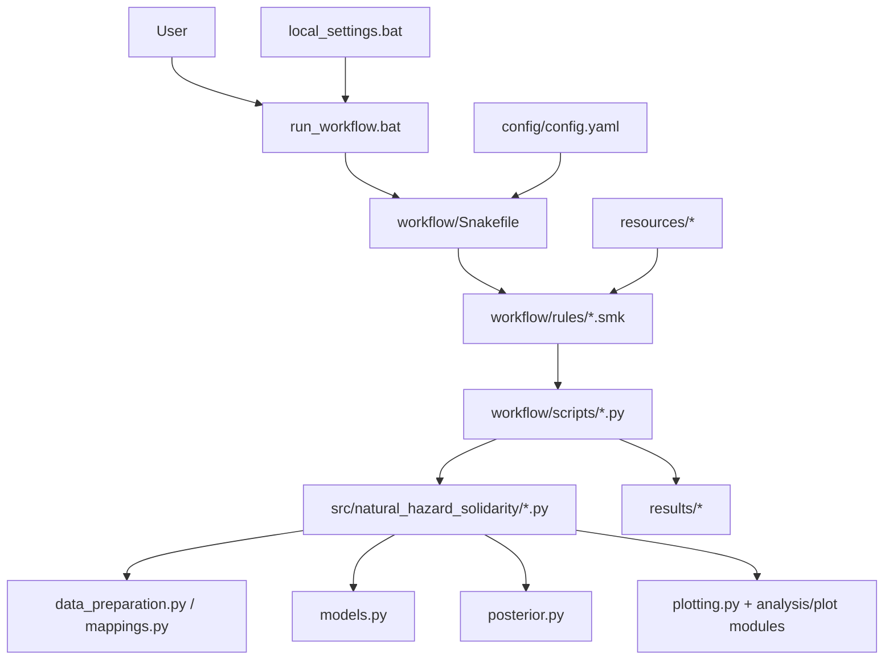

# Architecture and dependency flow

This document explains how the repository layers communicate. The dependency direction should remain one-way: workflow code may call reusable `src/` code, but `src/` code must not import Snakemake or hard-code workflow output paths.

## Code architecture

## Practical rule for contributors

- If a function can be tested without file paths or Snakemake, it probably belongs in `src/`.
- If code reads `snakemake.input`, `snakemake.params`, or `snakemake.output`, it belongs in `workflow/scripts/` or a rule file.
- If a value changes the scientific sample/model/quantity, it belongs in `config.yaml`.
- If a value only changes visual appearance, it belongs in `plotting.py` or the relevant plot module.
- Output directories and filenames belong to the workflow, not the scientific config.
