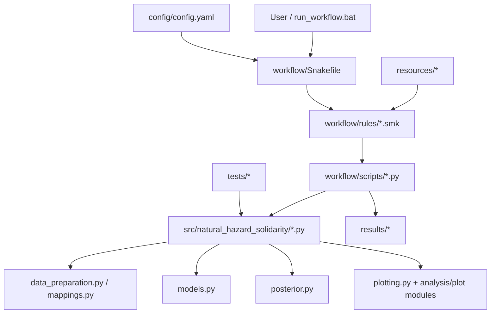

# Architecture and dependency flow

This document explains how the repository layers communicate. The dependency direction should remain one-way: workflow code may call reusable `src/` code, but `src/` code must not import Snakemake or hard-code workflow output paths.

## Code architecture



## Workflow DAG

```mermaid
flowchart LR
    subgraph Inputs[Local inputs]
      S0[Raw S0 survey CSV]
      S1[Raw S1 survey CSV]
      IDS[id_list.csv]
      GEO1[Swiss boundary GPKG]
      GEO2[Locality CSV]
    end

    subgraph Preprocessing[Preprocessing]
      CLEAN[clean_surveys]
      COMBINED[combined_surveys.parquet]
      SAMPLE[analysis_sample]
      ANALYSIS[analysis_sample.parquet]
      CONJ[conjoint_data]
      CONJOINT[conjoint_effect/dummy.parquet]
    end

    S0 --> CLEAN
    S1 --> CLEAN
    IDS --> CLEAN
    CLEAN --> COMBINED --> SAMPLE --> ANALYSIS --> CONJ --> CONJOINT

    subgraph Models[Models]
      FIT[fit_model {run}]
      NC[models/{run}.nc]
      COMP[compare_models]
    end
    CONJOINT --> FIT --> NC --> COMP

    subgraph Analyses[Figures and tables]
      DESC[descriptive plots]
      EFA[EFA]
      HYP[plot_hypothesis]
      RESP[plot_respondents]
      DIAG[plot_diagnostics]
      ROB[analyze_robustness]
    end
    ANALYSIS --> DESC
    ANALYSIS --> EFA
    NC --> HYP
    NC --> RESP
    NC --> DIAG
    NC --> ROB
    CONJOINT --> ROB

    subgraph Geography[Geographic branch]
      ASSIGN[assign_geography]
      ASSIGNMENTS[respondent_geography.parquet]
      SMAP[plot_survey_map]
      PMAP[plot_posterior_map]
    end
    COMBINED --> ASSIGN
    GEO1 --> ASSIGN
    GEO2 --> ASSIGN
    ASSIGN --> ASSIGNMENTS
    ANALYSIS --> SMAP
    ASSIGNMENTS --> SMAP
    GEO1 --> SMAP
    NC --> PMAP
    ANALYSIS --> PMAP
    ASSIGNMENTS --> PMAP
    GEO1 --> PMAP
```

## Practical rule for contributors

- If a function can be tested without file paths or Snakemake, it probably belongs in `src/`.
- If code reads `snakemake.input`, `snakemake.params`, or `snakemake.output`, it belongs in `workflow/scripts/` or a rule file.
- If a value changes the scientific sample/model/quantity, it belongs in `config.yaml`.
- If a value only changes visual appearance, it belongs in `plotting.py` or the relevant plot module.
- Output directories and filenames belong to the workflow, not the scientific config.
